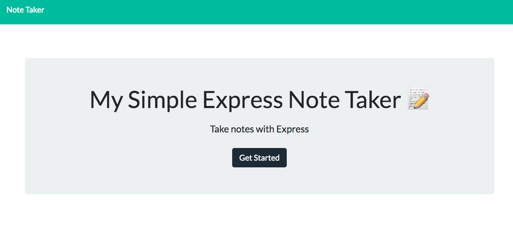
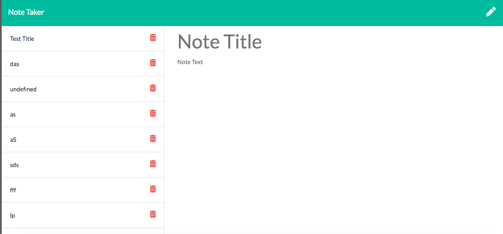
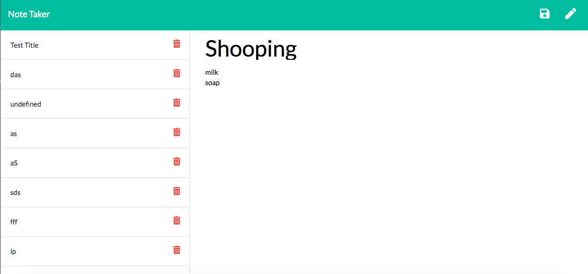

# My Simple Express Note Taker


## Description 

I modified a starter code to create an application called My Simple Express Note Taker that can be used to write and save notes. This application uses an Express.js back end and will save and retrieve note data from a JSON file.

The HTML has been provided. I build the back end and connected the two. 
This application is deploy to Heroku.


## User Story

```
AS A small business owner
I WANT to be able to write and save notes
SO THAT I can organize my thoughts and keep track of tasks I need to complete
```

## Table of Content

- [Installation](#installation)

- [Technology](#technology)

- [Usage](#usage)

- [Contributions](#contributions)

- [License](#license)

- [Questions](#questions)

## Installation

_Steps require to install this project and to get the development environment running:_

2. Run the command below in the terminal:

```bash
npm init
```
2. Run the command below in the terminal to install the Express package:

```bash
npm i express
```

## Technology
- HTML
- CSS
- Bootstrap
- JavaScript
- Node.js
- Express.js

## Usage

The following is the live link of the application:
- 


- The following images show the web application's appearance and functionality: 
    
  * Main page: Click on the Get Start button:   


  * Notes page: Click on the Title to begin typing:


  * Notes page: Click on the Save icon, to saved your notes or the Pencil icon, to get a new note :


## Contributions

The following were contributors to this project:

- [Nadia Dorado](https://github.com/ndorado3)
- GT Coding Bootcamp Projects Design Team 


## License
MIT

Copyright (c) [2021] [Nadia Dorado]

Permission is hereby granted, free of charge, to any person obtaining a copy of this software and associated documentation files (the "Software"), to deal in the Software without restriction, including without limitation the rights to use, copy, modify, merge, publish, distribute, sublicense, and/or sell copies of the Software, and to permit persons to whom the Software is furnished to do so, subject to the following conditions:

The above copyright notice and this permission notice shall be included in all copies or substantial portions of the Software.

THE SOFTWARE IS PROVIDED "AS IS", WITHOUT WARRANTY OF ANY KIND, EXPRESS OR IMPLIED, INCLUDING BUT NOT LIMITED TO THE WARRANTIES OF MERCHANTABILITY, FITNESS FOR A PARTICULAR PURPOSE AND NONINFRINGEMENT. IN NO EVENT SHALL THE AUTHORS OR COPYRIGHT HOLDERS BE LIABLE FOR ANY CLAIM, DAMAGES OR OTHER LIABILITY, WHETHER IN AN ACTION OF CONTRACT, TORT OR OTHERWISE, ARISING FROM, OUT OF OR IN CONNECTION WITH THE SOFTWARE OR THE USE OR OTHER DEALINGS IN THE SOFTWARE.

## Questions 
For questions about this project please contact me:  
* Email: nadiadorado@gmail.com 
* Github: https://github.com/ndorado3


